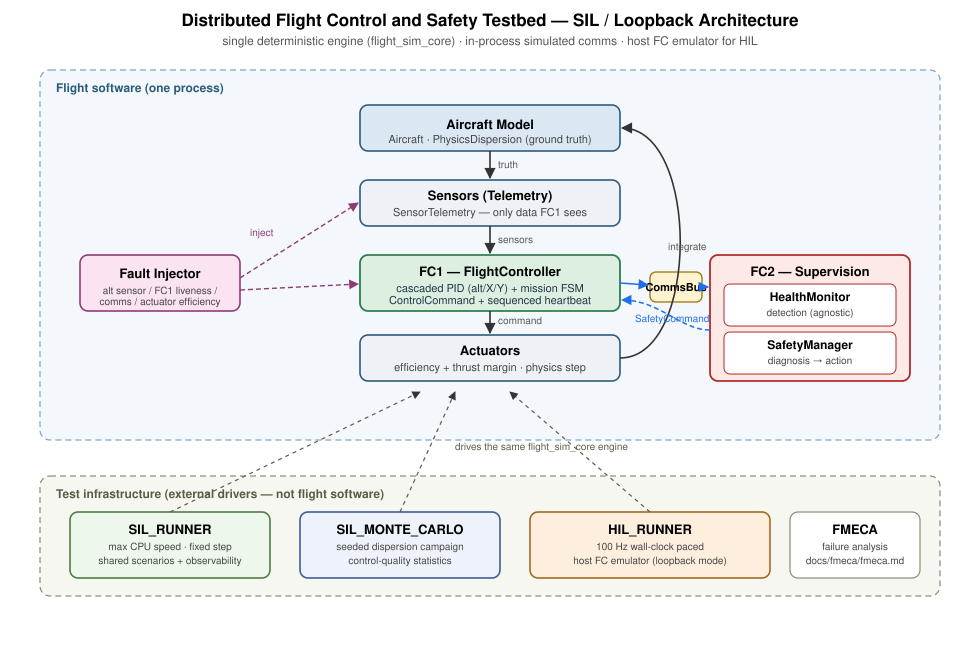

# Distributed Flight Control & Safety Testbed

A deterministic C++23 testbed that validates the **control, health-monitoring and
safety-management software** of a dual-computer (FC1/FC2) flight architecture
against a software aircraft simulation — through software-in-the-loop (SIL)
fault scenarios, Monte Carlo dispersion and a real-time (HIL) loop.

> There is **no real aircraft**. HIL can run against either the in-process FC
> emulator or a physical STM32 FC1 over a Linux serial device.

## What this project demonstrates

- **Embedded C++ (C++23 modules, `import std;`)**, no exceptions / no RTTI
  (`std::expected` / `std::optional`), fixed-width types, no heap in the loop.
- **Flight-control software**: cascaded PID (altitude / X / Y → servo mix),
  mission state machine (TAKEOFF → CLIMB → STATION_KEEPING → COMPLETE).
- **Distributed FC architecture**: FC1 (control + mission) ↔ in-process FC2
  (health monitoring + safety manager) over a simulated communication bus.
- **Real-time execution**: 100 Hz / 10 ms wall-clock-paced closed loop with
  deadline/jitter accounting (host-emulator HIL).
- **Health monitoring**: heartbeat supervision, sensor validation, actuator
  mismatch (detection is agnostic to the fault injector).
- **Safety state management**: `NORMAL` / `COMPENSATED` / `SAFE_MODE`, with a
  clean **detection → diagnosis → response** separation.
- **Communication**: sequenced heartbeat with link cutoff and seeded packet loss.
- **Fault injection**: FC1 failure, communication loss, invalid sensor data,
  actuator degradation — injected into the simulated environment.
- **SIL**: 6 deterministic fault scenarios + observability/telemetry suites.
- **Monte Carlo**: seeded physics-dispersion campaigns with reproducible seeds.
- **HIL**: real-time closed loop, byte-framed loopback protocol, timing stats.

## Architecture



Full explanation: [`docs/architecture/overview.md`](docs/architecture/overview.md).

```text
Aircraft → Sensors → FC1 (control+mission) → Actuators → Aircraft
FC1 ──heartbeat──► in-process CommsBus ──► FC2 (HealthMonitor → SafetyManager) ──SafetyCommand──► FC1
```

## Safety

```text
Failure Mode  →  Detection Event  →  Diagnosis (Health State)  →  Safety Action  →  Safety Mode  →  Mission outcome
```

Detection (`HealthMonitor`) and response (`SafetyManager`) are **separate**
components. Critical faults (`FC1_UNAVAILABLE`, `FC_COMMUNICATION_LOSS`) →
`SAFE_MODE` + mission abort (irreversible). Degrading faults (sensor, actuator)
→ `DEGRADED` → `COMPENSATED` (recoverable for sensor). Detail and coverage:
[`docs/fmeca/fmeca.md`](docs/fmeca/fmeca.md) ·
[`docs/safety/fault_taxonomy.md`](docs/safety/fault_taxonomy.md).

## Validation

| | What | Where |
| :-- | :-- | :-- |
| Matrix | what exactly is validated | [`docs/validation/test_matrix.md`](docs/validation/test_matrix.md) |
| SIL | deterministic fault scenarios | [`docs/validation/sil.md`](docs/validation/sil.md) |
| HIL | real-time loop + timing | [`docs/validation/hil.md`](docs/validation/hil.md) |
| Monte Carlo | dispersion campaign | [`docs/validation/monte_carlo.md`](docs/validation/monte_carlo.md) |
| Report | executive summary | [`docs/validation/validation_report.md`](docs/validation/validation_report.md) |
| Demos | fault recovery · mission abort | [`docs/demonstrations/`](docs/demonstrations/) |

## Demo

```text
SIL_RUNNER --all                     # all deterministic SIL + observability + telemetry suites
SIL_RUNNER --scenario NOMINAL-001    # one nominal mission (verbose: add -v)
HIL_RUNNER --selftest                 # deterministic HIL validation suite
HIL_RUNNER --scenario NOMINAL-001    # real-time nominal closed loop (30 s)
HIL_RUNNER --scenario FAULT_INJECTOR-001   # HIL FC1-failure → abort + descent
SIL_MONTE_CARLO --runs 50             # Monte Carlo dispersion campaign
```

## Example result (nominal SIL/HIL, representative)

```text
[MISSION] t = 0.77 s -> CLIMB
[MISSION] t = 2.89 s -> STATION_KEEPING
[MISSION] t = 7.91 s -> MISSION_COMPLETE
...
Mission success : YES   Final state : COMPLETE   Safety : NORMAL   Health : HEALTHY   Verdict : PASS
```

For the abort path (`FAULT_INJECTOR-001`):

```text
[FAULT] t = 5.00 s -> FAULT_INJECTED (FC1_UNAVAILABLE)
[SAFETY] t = 5.10 s -> HEARTBEAT_TIMEOUT
[SAFETY] t = 5.10 s -> SAFETY_STATE_TRANSITION (NORMAL -> SAFE_MODE)
[MISSION] t = 5.10 s -> MISSION_ABORTED   (detection latency 0.1000 s, verdict PASS)
```

> Outputs above are representative/expected (deterministic engine). Build & run
> on the configured toolchain to capture real artifacts under
> `docs/validation/data/` (gitignored).

## Current status

| Area | Status |
| :-- | :-- |
| Control / mission logic, SIL loop | **Implemented & Validated (SIL)** |
| Safety/detection chain (FM-01..FM-05) | **Implemented & Validated (SIL/HIL)** |
| Real-time HIL loop + timing | **Implemented** for host emulator and physical STM32 FC1 over serial |
| Monte Carlo (control-quality dispersion) | **Implemented & Validated (tooling)** |
| Monte Carlo over faults | **Not wired** (library code only, no CLI) |
| FM-06 control-deadline · FM-07 numerical-state | **Not implemented** |
| Communication degraded scenario | **Limited** (injector/CommsBus layer, no named scenario) |
| Multi-process / UDP / CAN transport | **Not implemented** (intended evolution only) |

## Limitations

- Physical FC1 HIL uses a Linux serial device at 460800 baud; other host platforms are not implemented.
- Single process; FC1/FC2 are in-memory objects (no OS-level isolation).
- Simplified VTOL dynamics for control-software development only.
- Only altitude/baro sensor + main-rotor actuator are injectable; IMU/GNSS/RPM/servo faults have no injection path.
- No local task watchdog; no numerical-integrity (`isfinite`) guard.
- Critical faults (heartbeat/comm timeout) are latched and irreversible.
- Building requires a C++23-modules toolchain (GCC 16 or MSVC 2026, `import std;`) — **not** GCC ≤ 12.

## Build

Requires **CMake 4.1+** and a **C++23-modules-capable** compiler
(`import std;`): MSVC 2026 or GCC 16+.

```text
# Linux (Ninja + GCC 16)
cmake -S . -B build/linux -G Ninja -DCMAKE_BUILD_TYPE=Release -DCMAKE_CXX_COMPILER=g++
cmake --build build/linux

# STM32 Nucleo-L476RG firmware
west build -b nucleo_l476rg apps/fc1_stm32 -d build/fc1_stm32 --pristine
west build -b nucleo_l476rg apps/fc2_stm32 -d build/fc2_stm32 --pristine

# Windows (MSVC 2026)
cmake --preset release
cmake --build --preset release
```

Executables are `sil_runner`, `hil_runner`, and `sil_monte_carlo`. Named deployable
outputs are copied under `artifacts/linux/` and `artifacts/stm32/`. See
[`docs/build/build_targets.md`](docs/build/build_targets.md) for exact paths,
flashing commands, and the current physical-HIL boundary.

> This report was prepared in an environment with only GCC 12.2 and no `cmake`,
> which cannot compile `import std;`; the validation results in the docs are the
> deterministic, assertion-based expected results, with exact reproduction
> commands provided. Run them on the configured toolchain to capture artifacts.

## Project structure

```text
Src/
  Control/        FlightController (cascaded PID + mission FSM)
  Safety/         HealthMonitor (detection) · SafetyManager (response)
  Simulation/     Aircraft physics · PhysicsDispersion
  SIL/            SilRunner + fault taxonomy + telemetry/comms/reporting + validation
  Embedded/       HAL + HIL wire protocol + HIL runner (host emulator)
  Runners/        SIL / HIL / MonteCarlo main entry points
Tests/            SilScenarios · HilTests · Scenarios catalog · MissionRunner · observability
docs/
  architecture/   overview.md · architecture.svg
  validation/     test_matrix · sil · hil · monte_carlo · validation_report
  demonstrations/ fault_recovery · mission_abort
  fmeca/          fmeca.md   (canonical safety/failure analysis)
  safety/         fault_taxonomy.md (canonical vocabulary)
```

More detail and a docs index: [`docs/README.md`](docs/README.md).
